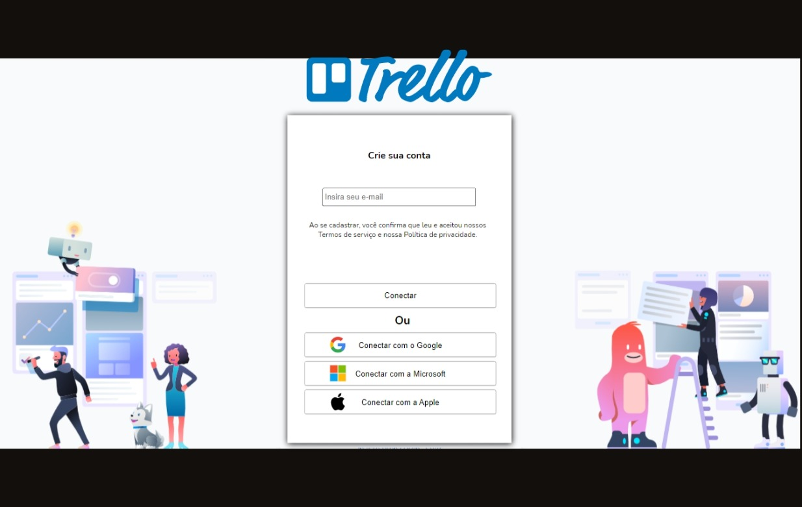
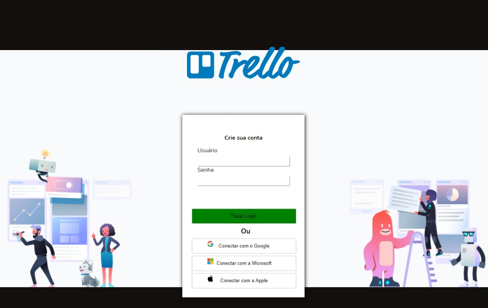

# Recriando o Interface do Trello

Interface do Trello sendo utilizada para estilização de um projeto Kanban

<h4 align="center"> 
	🚧  React Kanban 🚀 Em construção...  🚧
</h4>

### Em desenvolvimento
- [x] Dashboard
### Features

- [ ] Transformar em NextJS
- [x] Home
- [x] Cadastro
- [x] Login
- [ ] Recriar Drag and drop
- [ ] Dashboard
- [ ] Actions
- [ ] Api em Node

Indices da aplicação
=================
<!--ts-->
   * [Features](#Features)
   * [Tecnologias](#tecnologias)
   * [Instalação](#instalação)
   * [Como usar](#comandos)
   * [Sobre](#Detalhes-da-aplicação)
<!--te-->

<details>
  <summary>Telas da aplicação</summary>
    
    
    
</details>


## Tecnologias

<br>
Tecnologias utilizadas:<br>

<a href="https://code.visualstudio.com/"></a>
<a href="https://pt-br.reactjs.org/"></a>
<a href="https://www.w3schools.com/css/"></a>
<a href="https://www.typescriptlang.org/"></a>

### Pré-requisitos

Antes de começar, você vai precisar ter instalado em sua máquina as seguintes ferramentas:
[Git](https://git-scm.com), [Node.js](https://nodejs.org/en/), [Yarn](https://yarnpkg.com/) 
Além disto é bom ter um editor para trabalhar com o código como [VSCode](https://code.visualstudio.com/)

### 🎲 Instalação

```bash
# Clone este repositório
$ git clone https://github.com/QuintanC/drag-and-drop

# Acesse a pasta do projeto no terminal/cmd
$ cd drag-and-drop

# Instale as dependências
$ yarn

# Execute a aplicação em modo de desenvolvimento
$ yarn dev

# O servidor inciará na porta:3000 - acesse <http://localhost:3000>
```
## Detalhes da aplicação  ` 
<br>
Ainda em desenvolvimento, o projeto tem como objetivo apenas estudo na Linguaguem de Programação Javascript e no Framework ReactJS <br>
Necessario Recriar Drag and drop - https://www.youtube.com/watch?v=awRtgpRsdTQ&ab_channel=Rocketseat
